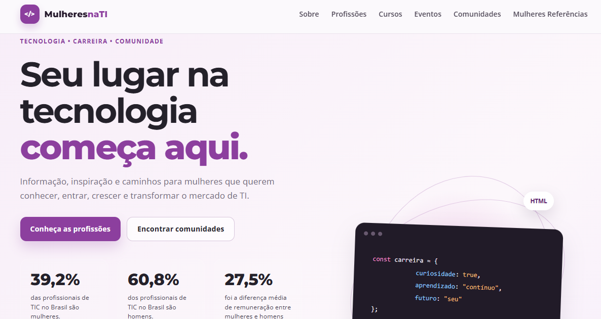

# 💻 Mulheres na TI ♀️


O **Mulheres na TI** é um site desenvolvido com o objetivo de incentivar e apoiar a participação de mulheres no mercado de Tecnologia da Informação.

O site apresenta informações sobre diferentes áreas da tecnologia, caminhos de aprendizagem, eventos, comunidades e mulheres que são referências na área.

A proposta é reunir informações que possam ajudar mulheres que desejam conhecer, ingressar ou desenvolver uma carreira no setor de tecnologia.

Este projeto foi desenvolvido para a disciplina de **Atividade Extensionista II**, do curso de **Análise e Desenvolvimento de Sistemas da UNINTER**.


## 🎯 Objetivos

- 🚀 Incentivar mulheres a conhecerem o mercado de Tecnologia da Informação 
- 💼 Apresentar diferentes profissões e áreas de atuação em TI 
- 📚 Indicar cursos e caminhos para iniciar os estudos 
- 📅 Divulgar eventos relacionados à tecnologia 
- 👩‍💻 Apresentar comunidades voltadas para mulheres na tecnologia  
- ⭐ Mostrar mulheres que são referências na área 
- ♀️ Contribuir para a promoção da diversidade e inclusão no setor de tecnologia. 


## 🖥️ Preview

<p align="center">
  
</p>


## 🛠️ Tecnologias utilizadas

- HTML5
- CSS3
- JavaScript

Também foram utilizados:

- Google Fonts
- Git
- GitHub


## 📁 Estrutura do projeto

```text
mulheres-na-ti-site/
│
├── index.html
├── style.css
├── script.js
│
├── perfil.jpg
├── Ada_Lovelace.jpg
├── Grace_Hopper.jpg
├── Katherine_Johnson.jpg
├── Margaret_Hamilton.jpg
│
├── linkedin.png
├── github.png
├── preview.png
│
└── README.md
